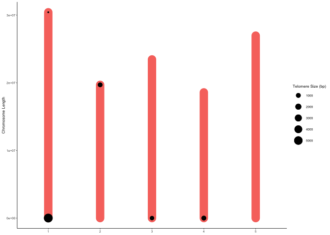
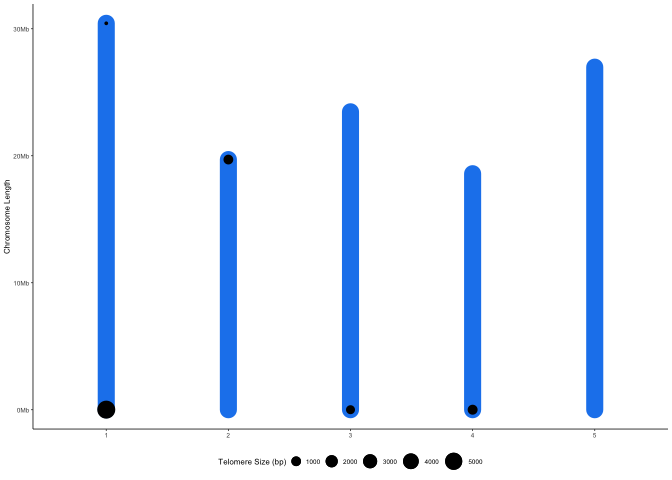
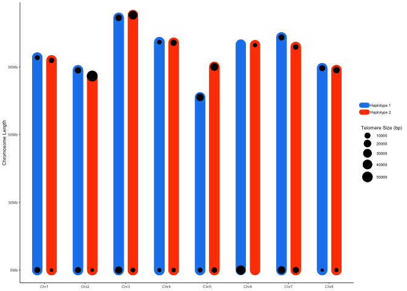

ggnomics
================
Matthew Davis
2024-11-25

## Table of Contents

- [Introduction](#introduction)
- [Installation](#installation)
- [Usage](#usage)
- [Functions](#functions)
- [Arguments](#arguments)
- [Examples](#examples)
- [Legacy](#legacy)

## Introduction

`ggnomics` is an R package that provides data visualizations using
ggplot2. It offers functions to dynamically plot genomes for exploratory
data analysis. `ggnomics` aims to utilize ggplot syntax to provide
base-level genomic plots that can later be customized by the user.

## Installation

### Installing Dependencies

To install required dependencies, you can use the following code:

``` r
install.packages(c("data.table", "tidyverse", "scales", "pbapply"))

if (!requireNamespace("BiocManager", quietly = TRUE)) {
    install.packages("BiocManager")
}
BiocManager::install("Biostrings")
```

### Installing `ggnomics`

You can install `ggnomics` from GitHub using the following command:

``` r
if (!requireNamespace("devtools", quietly = TRUE)) {
  install.packages("devtools")
}

devtools::install_github("matthewwdavis/ggnomics")
```

## Usage

`ggnomics` has two main functionalities: data analysis and plotting. The
data analysis tools are set up to be used with the plotting functions. A
typical workflow will use a specific data analysis tool to generate a
data set with specific formatting. This data set will then be
incorporated into the respective plotting functions.

With the goal of replicating `ggplot2` syntax, `ggnomics` uses a wrapper
function, `ggnom` to read in data created by other functions. Plotting
functions will be added as `geom_` and attached to `ggnom` with a `+`.

The next section will tackle examples using real data.

## Functions

The functions in `ggnomics` create specifically structured data frames
for plotting. `ggnomics` is expected to continually evolve, with more
functions for analysis and plotting added overtime.

Below are some current functions in `ggnomics` and a very brief
description of their usage:

**Current `ggnomics` functions:**  
- `ggread_fasta` reads in fasta files.  
- `telomere_plotting_table` generates the data in a format necessary for
`geom_telplot`.  
- `ggnom` initializes a ggplot2 object.  
- `geom_telplot` creates a plot of chromsomes with telomeric sequence
marked by size  
- `create_window_fasta` creates windows from a fasta file read in with
`ggread_fasta` or `readDNAStringSet` - `sliding_window_table` creates
sliding windows from a table with columns CHROM and POS

There are many functions that are rarely used on their own and are
instead used to facilitate other, larger functions. Those functions will
not receive in depth documentation here, but they are available as
separate functions for the user regardless. The code of these functions
can be viewed in R with `View(function_name)`.

## Arguments

## Examples

The following examples are meant to walk the user through using the
package from data download to plotting. Publicly available data is used
so that the users results can be compared here to make sure everything
is operating correctly.

### Creating telomere plots with geom_telplot()

Downloading an example fasta file (Arabidopsis TAIR10):

``` r
download.file("https://ftp.ensemblgenomes.ebi.ac.uk/pub/plants/release-60/fasta/arabidopsis_thaliana/dna/Arabidopsis_thaliana.TAIR10.dna.toplevel.fa.gz", destfile = "./arabidopsis_tair10.fasta.gz", mode = "wb")
```

The first step is to load the library

``` r
library(ggnomics)
```

    ## Loading ggideo and required packages...

After loading the library, read in the fasta file with `ggread_fasta`

Read in the example fasta to use for ggnomics:  
- This creates a DNAStringSet object of a fasta file of interest for
downstream analysis.

``` r
genome <- ggread_fasta("./arabidopsis_tair10.fasta.gz")
```

Next the user should use a data analysis function :  
- In this example, the function creates a table with telomere counts

``` r
telo.table <- telomere_plotting_table(genome, chr_names = "^\\d")
# "^\\d" is used here to specify that the chromosome names begin with a number, as we are not interested in plotting the plasmid genomes.

print(telo.table)
```

    ##    Chromosome   Length Forward_Counts Reverse_Counts begin_telo_bp end_telo_bp
    ##        <fctr>    <int>          <int>          <int>         <num>       <num>
    ## 1:          1 30427671            270              1          5670          21
    ## 2:          2 19698289              0             49             0        1029
    ## 3:          3 23459830             37              0           777           0
    ## 4:          4 18585056             52              0          1092           0
    ## 5:          5 26975502             NA             NA            NA          NA
    ##    begin_telo_start begin_telo_end end_telo_start end_telo_end total_telo_bp
    ##               <num>          <num>          <num>        <int>         <num>
    ## 1:                0           5670       30427650     30427671          5691
    ## 2:                0              0       19697260     19698289          1029
    ## 3:                0            777       23459830     23459830           777
    ## 4:                0           1092       18585056     18585056          1092
    ## 5:                0             NA             NA     26975502            NA
    ##    normalized_total_telo_size
    ##                         <num>
    ## 1:               4.776479e-05
    ## 2:               8.636438e-06
    ## 3:               6.521392e-06
    ## 4:               9.165199e-06
    ## 5:                         NA

**NOTE:** It is always a good idea to inspect the table and ensure you
are seeing what is expected. In this case, Chromosome 5 had no detected
telomeric repeat, and so it has NA values.

Then, the user can utilize the `ggnom` function paired with the
`geom_telplot` function to create a telomere plot:  
- If the user wants to create a telomere plot, this is the required
mapping within `aes`

``` r
ggnom(telo.table, aes(x = Chromosome, y = begin_telo_start, yend = Length)) +
  geom_telplot()
```

<!-- -->

There are some arguments within `geom_telplot` to specify shape and
color:

``` r
ggnom(telo.table, aes(x = Chromosome, y = begin_telo_start, yend = Length)) +
  geom_telplot(chr_color = "bisque2", tel_color = "darkgreen", tel_shape = 18)
```

<!-- -->

Since all plots are `ggplot2` based, they can be edited and adjusted
like any ggplot:  
- The user can add adjustments with `+`, just like in `ggplot`

``` r
ggnom(telo.table, aes(x = Chromosome, y = begin_telo_start, yend = Length)) +
  geom_telplot(chr_color = "bisque2", tel_color = "darkgreen", tel_shape = 18) +
    scale_y_continuous(labels = label_number(scale = 1e-6, suffix = "Mb")) +
    labs(y = "Sequence Length", x = "Chromosome", size = "Telomere Size", title = "ggnomics Telomere Plot") +
    theme_classic(base_size = 6) +
    theme(legend.position = "bottom",
          legend.key.size = unit(0.2, "cm"),
          plot.title = element_text(hjust = 0.5, face = "bold"))
```

<!-- -->

## Legacy

These functions were originally from the `ggideo` package. While that
package has been archived, the functions will continue to exist in
`ggnomics`, albeit with little continuous upkeep.

Below is an example of how to use these legacy functions:

- `ggideo` is used to plot telomere plots of primary assemblies

``` r
library(ggnomics)

# Generate the data and the plot, stored as a list
genome.plot <- ggideo("./arabidopsis_tair10.fasta.gz", chr_names = "^\\d")
```

- Print the table

``` r
genome.plot$genomic.table
```

- Print the plot

``` r
genome.plot$ideogram
```

<!-- -->

- `ggideo_diploid` is used to plot telomere plots of haplotype phased
  diploid assemblies. The haplotypes can be two separate fasta files, or
  a fasta file with both haplotypes present. The haplotypes should be
  identified with “\_hap1” and “\_hap2”
- Example of the two separate fasta files

``` r
library(ggnomics)

# Generate the data and the plot, stored as a list
genome.plot <- ggideo_diploid("./genome_hap1.fasta.gz", "./genome_hap2.fasta.gz")
```

    ## Joining with `by = join_by(Chromosome, Length, Forward_Counts, Reverse_Counts,
    ## begin_telo_bp, end_telo_bp, begin_telo_start, begin_telo_end, end_telo_start,
    ## end_telo_end, total_telo_bp, normalized_total_telo_size, Hap)`

- Print the table

``` r
genome.plot$genomic.table
```

- Print the plot

``` r
genome.plot$ideogram
```

<!-- -->

- Example of usage with both haplotypes in one combined fasta file

``` r
library(ggnomics)

# Generate the data and the plot, stored as a list
genome.plot <- ggideo_diploid(combined_hap_fasta = "./genome_combohap.fasta.gz",
                              string_remove = "_hap\\d_RagTag")
```

    ## Joining with `by = join_by(Chromosome, Length, Hap, Forward_Counts,
    ## Reverse_Counts, begin_telo_bp, end_telo_bp, begin_telo_start, begin_telo_end,
    ## end_telo_start, end_telo_end, total_telo_bp, normalized_total_telo_size)`

- Print the table

``` r
genome.plot$genomic.table
```

- Print the plot

``` r
genome.plot$ideogram
```

<!-- -->
