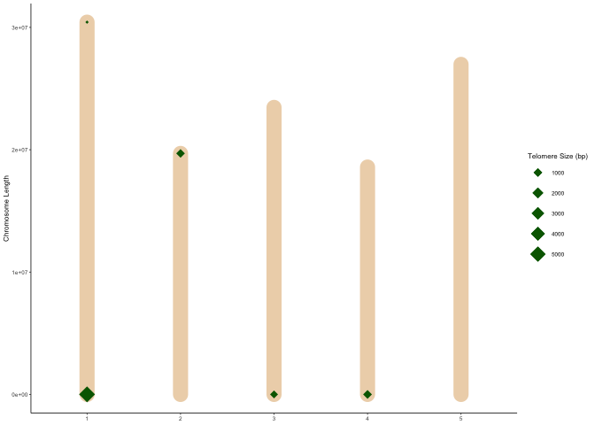
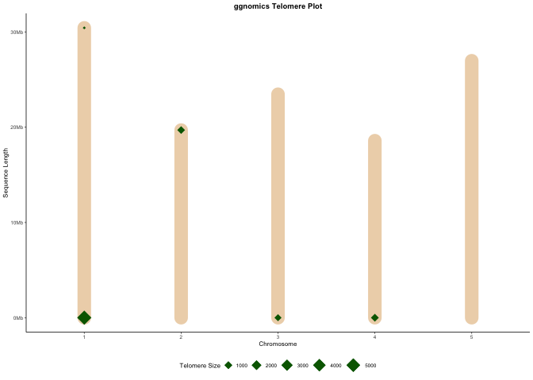
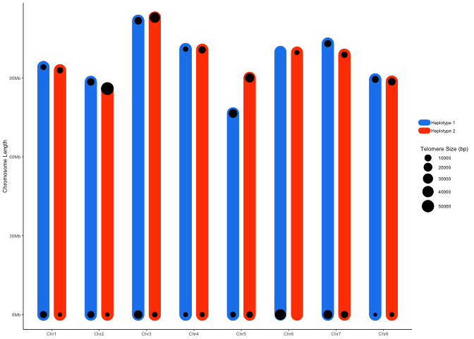

ggnomics
================
Matthew Davis
2024-11-25

## Table of Contents

- [Introduction](#introduction)
- [Installation](#installation)
- [Functions](#functions)
- [Arguments](#arguments)
- [Usage](#usage)
- [Examples](#examples)
- [Legacy](#legacy)

## Introduction

`ggnomics` is an R package that provides data visualizations using
ggplot2. It offers functions to dynamically plot genomes for exploratory
data analysis. `ggnomics` aims to utilize ggplot syntax to provide
base-level genomic plots that can later be customized by the user.

## Installation

### Installing Dependencies

To install required dependencies, you can use the following code:

``` r
install.packages(c("data.table", "tidyverse", "scales", "pbapply"))

if (!requireNamespace("BiocManager", quietly = TRUE)) {
    install.packages("BiocManager")
}
BiocManager::install("Biostrings")
```

### Installing `ggnomics`

You can install `ggnomics` from GitHub using the following command:

``` r
if (!requireNamespace("devtools", quietly = TRUE)) {
  install.packages("devtools")
}

devtools::install_github("matthewwdavis/ggnomics")
```

## Functions

There are many functions in `ggnomics` used for evaluating genomes. As
`ggnomics` evolves, more functions will be added. Many functions are
rarely used on their own and are instead used within other functions.
These internally used functions will not recieve indepth be
documentation here , but are available as separate functions for the
user regardless. The code of these functions can be viewed in R with
`View(function_name)`.

**Current `ggnomics` functions:**  
- `ggread_fasta` reads in fasta files.  
- `telomere_plotting_table` generates the data in a format necessary for
`geom_telplot`.  
- `ggnom` initializes a ggplot2 object.  
- `geom_telplot` creates a plot of chromsomes with telomeric sequence
marked by size  
- `create_window_fasta` creates windows from a fasta file read in with
`ggread_fasta` or `readDNAStringSet` - `sliding_window_table` creates
sliding windows from a table with columns CHROM and POS

## Arguments

## Usage

With the goal of replicating `ggplot2` syntax, `ggnomics` uses a wrapper
function, `ggnom` to read in data created by other functions.

## Examples

Downloading an example fasta file (Arabidopsis TAIR10):

``` r
download.file("https://ftp.ensemblgenomes.ebi.ac.uk/pub/plants/release-60/fasta/arabidopsis_thaliana/dna/Arabidopsis_thaliana.TAIR10.dna.toplevel.fa.gz", destfile = "./arabidopsis_tair10.fasta.gz", mode = "wb")
```

Read in the example fasta to use for ggnomics:

## Legacy

These functions were originally from the `ggideo` package. While that
package has been archived, the functions will continue to exist in
`ggnomics`, albeit with little continuous upkeep.

Below is an example of how to use these legacy functions:

- `ggideo` is used to plot telomere plots of primary assemblies

``` r
library(ggnomics)

# Generate the data and the plot, stored as a list
genome.plot <- ggideo("./arabidopsis_tair10.fasta.gz", chr_names = "\\d")

# Print the plot
genome.plot$ideogram
```

<!-- -->

``` r
# Print the resulting table
genome.plot$genomic.table
```

- `ggideo_diploid` is used to plot telomere plots of haplotype phased
  diploid assemblies. The haplotypes can be two separate fasta files, or
  a fasta file with both haplotypes present. The haplotypes should be
  identified with “\_hap1” and “\_hap2”
- Example of the two separate fasta files

``` r
library(ggnomics)

# Generate the data and the plot, stored as a list
genome.plot <- ggideo_diploid("./genome_hap1.fasta.gz", "./genome_hap2.fasta.gz")
```

    ## Joining with `by = join_by(Chromosome, Length, Forward_Counts, Reverse_Counts,
    ## begin_telo_bp, end_telo_bp, begin_telo_start, begin_telo_end, end_telo_start, end_telo_end,
    ## total_telo_bp, normalized_total_telo_size, Hap)`

``` r
# Print the resulting table
genome.plot$genomic.table

# Print the plot
genome.plot$ideogram
```

<!-- -->

- Example of usage with both haplotypes in one combined fasta file

``` r
library(ggnomics)

# Generate the data and the plot, stored as a list
genome.plot <- ggideo_diploid(combined_hap_fasta = "./genome_combohap.fasta.gz",
                              string_remove = "_hap\\d_RagTag")
```

    ## Joining with `by = join_by(Chromosome, Length, Hap, Forward_Counts, Reverse_Counts,
    ## begin_telo_bp, end_telo_bp, begin_telo_start, begin_telo_end, end_telo_start, end_telo_end,
    ## total_telo_bp, normalized_total_telo_size)`

``` r
# Print the resulting table
genome.plot$genomic.table

# Print the plot
genome.plot$ideogram
```

<!-- -->

``` r
rmarkdown::render("README.Rmd", output_format = "github_document")
```
